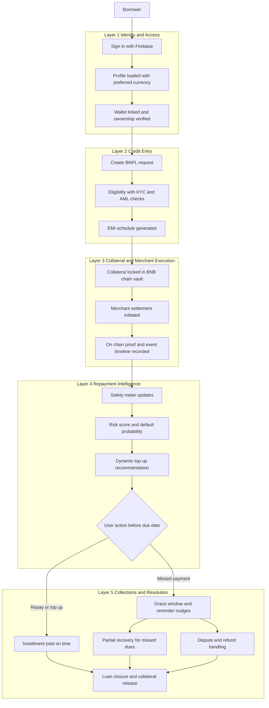
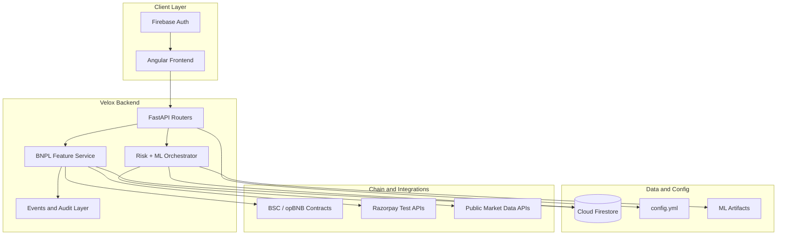

# Velox: Smart Collateral Credit Rail on BNB Chain

Velox is a **BNB Chain-first, non-custodial BNPL and Web3 credit layer** built for real-world checkout and repayment behavior.
Users lock on-chain collateral, merchants get paid upfront, and credit risk is managed through transparent safety rules, partial recovery, and explainable ML signals.

## Quick Start (One Command)

### Windows (PowerShell)
```powershell
powershell -ExecutionPolicy Bypass -File .\setup_and_run.ps1
```
Optional (skip dependency reinstall):
```powershell
powershell -ExecutionPolicy Bypass -File .\setup_and_run.ps1 -SkipInstall
```

### macOS/Linux (Bash)
```bash
bash ./setup_and_run.sh
```
Optional (skip dependency reinstall):
```bash
bash ./setup_and_run.sh --skip-install
```

### What this does
1. Creates `.venv` if needed.
2. Installs backend dependencies from `backend/requirement.txt`.
3. Installs frontend dependencies in `ping_masters_ui/`.
4. Starts FastAPI backend + Angular frontend together.

After startup:
- Backend: `http://127.0.0.1:8000/docs`
- Frontend: `http://localhost:4200`

---

## Why Velox Matters (Hackathon Pitch)

### Problem
BNPL and crypto lending systems still struggle with:
- Custody risk
- Poor liquidation UX
- Opaque recovery behavior
- Weak merchant trust in collateral guarantees

### Velox Approach
Velox introduces a **shared smart-collateral layer** on BNB Chain:
- Borrower locks collateral in a verifiable vault.
- Merchant is settled upfront (test settlement flow integrated).
- Borrower repays in EMI/installments.
- If risk increases, system nudges and recommends top-up early.
- If default happens, system attempts **partial recovery** (only required amount), not full seizure.

### BNB Chain Focus
- Built for **BSC + opBNB** integration paths.
- Smart contract addresses and proof data integrated in backend APIs.
- Designed for high-throughput, low-cost on-chain credit interactions.

---

## How Judges Can Score Velox Fast

| Criteria | What Velox demonstrates |
|---|---|
| Design & Usability | Clean borrower flow, wallet + loan dashboard, explainability panel, proof timeline |
| Scalability | Modular services, model layer, Firestore repositories, config-driven policies |
| Innovation | Smart-collateral BNPL, partial liquidation, risk-driven nudges, dynamic deposit recommendation |
| Open Source | Documented APIs, reproducible setup scripts, structured ML scripts/artifacts |
| Integration | Firebase, Razorpay (test mode), BNB chain/web3 integration, market data feeds |

---

## Product User Flow



## Tech Stack and Integration Flow



---

## Current Feature Highlights

### Core credit + collateral
- Collateral lock and top-up
- BNPL plan creation and installment schedule
- Safety meter (health factor + status)
- Grace and recovery workflows
- Partial recovery handling
- Audit-friendly event trail

### Smart risk layer
- Rule-based risk score
- ML-backed risk/deposit inference endpoints
- Dynamic deposit recommendation (policy + model mode)
- Explainability payload for user-facing trust

### Merchant + trust
- Merchant settlement simulation
- Public proof payload with contract references and timeline

---

## Documentation Index

- API documentation: [backend/API_DOCUMENTATION.md](backend/API_DOCUMENTATION.md)
- Solidity/API mapping: [backend/SOLIDITY_API_DOCUMENTATION.md](backend/SOLIDITY_API_DOCUMENTATION.md)
- Firestore storage map: [backend/FIREBASE_STORAGE.md](backend/FIREBASE_STORAGE.md)
- User flow notes: [user_flow.md](user_flow.md)
- Architecture Diagram: [backend/ARCHITECTURE.md](backend/ARCHITECTURE.md)

---

## Repository Structure

```text
backend/            FastAPI app, services, models, route handlers
ping_masters_ui/    Angular frontend
contracts/          Solidity contracts and chain integration scripts
ml/                 ML modules, artifacts, and inference helpers
```

---

## Manual Run (Fallback)

### Backend
```powershell
py -3 -m venv .venv
.\.venv\Scripts\python -m pip install --upgrade pip
.\.venv\Scripts\python -m pip install -r .\backend\requirement.txt
.\.venv\Scripts\python .\backend\main.py
```

### Frontend
```powershell
cd .\ping_masters_ui
npm install
npm start
```

---

## 60-Second Judge Demo Script

1. Create a loan plan and lock collateral.
2. Show merchant settlement/proof data.
3. Open safety meter + risk tier + recommendation.
4. Trigger repayment/default simulation.
5. Show partial recovery and event proof timeline.
6. Close with auditability + scalability architecture.

---

## Notes

- Runtime config is centralized in `backend/config.yml`.
- Razorpay integration is configured for test-mode credentials.
- Python 3.10+ is recommended for dependency compatibility.
