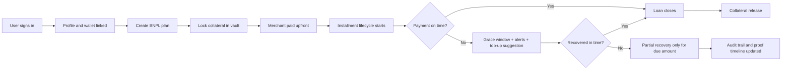
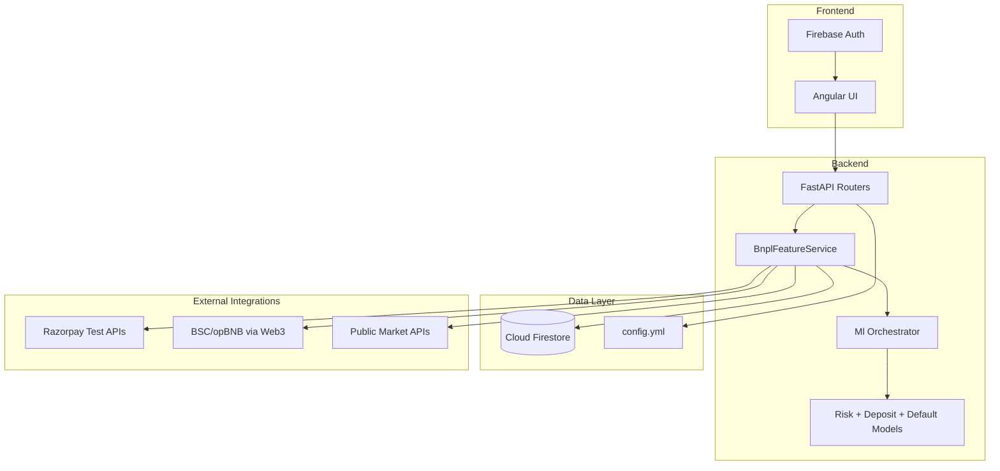

# Ping Masters: Smart Collateral for Web3 Credit

## 1-Command Setup and Run (Top Priority for Judges)

### Windows (PowerShell)
```powershell
powershell -ExecutionPolicy Bypass -File .\setup_and_run.ps1
```
Optional (skip dependency reinstall):
```powershell
powershell -ExecutionPolicy Bypass -File .\setup_and_run.ps1 -SkipInstall
```

### macOS/Linux (Bash)
```bash
bash ./setup_and_run.sh
```
Optional (skip dependency reinstall):
```bash
bash ./setup_and_run.sh --skip-install
```

### What the script does
1. Creates `.venv` if missing.
2. Installs backend dependencies from `backend/requirement.txt`.
3. Installs frontend dependencies in `ping_masters_ui/`.
4. Starts backend (`FastAPI`) and frontend (`Angular`) together.

After startup:
- Backend: `http://127.0.0.1:8000/docs`
- Frontend: `http://localhost:4200`

---

## Project Pitch (Judge-Friendly)

Ping Masters is a **non-custodial BNPL + Web3 credit layer** where users lock collateral in programmable vaults, merchants get paid upfront, and default handling is transparent, auditable, and partial (only what is needed).

### The problem
Traditional crypto credit/BNPL systems are often:
- Opaque in risk and recovery
- Weak in user explainability
- Fragile under volatility
- Hard to trust for merchants and borrowers

### Our solution
We combine:
- **Collateral-backed BNPL plans**
- **Safety meter + proactive risk alerts**
- **Partial recovery instead of full seizure**
- **ML-assisted risk and deposit recommendations**
- **Proof timeline for verifiable trust**

---

## Why This Scores Well Against Judging Criteria

| Judging Criterion | How Ping Masters Delivers |
|---|---|
| Design & Usability | Clear borrower flow (plan, collateral, safety, repay), simple dashboards, explainability panel |
| Scalability | Modular FastAPI services, repository abstractions, Firestore collections, config-driven policies |
| Innovation | Smart-collateral BNPL, dynamic deposit recommendation, default prediction nudges, partial recovery |
| Open Source | Modular codebase, documented APIs, reproducible local setup, ML scripts and artifacts |
| Integration | Firebase Auth/Firestore, Razorpay test integration, Web3 endpoints, market-data and oracle-style feeds |

---

## Product User Flow



## Tech Stack Flow



---

## Hackathon Feature Coverage (High-Impact Slice)

### Core features implemented
- Vault collateral lock
- BNPL plan + installment schedule generation
- Safety meter (health factor + color)
- Top-up collateral
- Partial recovery workflow
- Merchant settlement simulation
- Public proof payload
- Explainability output
- Rule + ML-based risk/deposit intelligence

### ML capabilities
- Risk tier scoring
- Dynamic deposit recommendation (policy + ML)
- Default prediction with preventive nudge hooks

---

## API References

- Full backend API docs: [backend/API_DOCUMENTATION.md](backend/API_DOCUMENTATION.md)
- Solidity-facing API docs: [backend/SOLIDITY_API_DOCUMENTATION.md](backend/SOLIDITY_API_DOCUMENTATION.md)
- Firebase storage map: [backend/FIREBASE_STORAGE.md](backend/FIREBASE_STORAGE.md)

---

## Repository Layout

```text
backend/            FastAPI app, services, models, ML integration
ping_masters_ui/    Angular UI
contracts/          Solidity contracts + deploy/test scripts
ml/                 Additional model package and training assets
```

---

## Manual Run (if needed)

### Backend
```powershell
py -3 -m venv .venv
.\.venv\Scripts\python -m pip install --upgrade pip
.\.venv\Scripts\python -m pip install -r .\backend\requirement.txt
.\.venv\Scripts\python .\backend\main.py
```

### Frontend
```powershell
cd .\ping_masters_ui
npm install
npm start
```

---

## Demo Narrative for Judges (60-second walk-through)

1. User logs in, creates a BNPL plan, and locks collateral.
2. Merchant receives upfront settlement proof.
3. Dashboard shows safety meter, risk tier, and recommended top-up.
4. If user misses payment, system enters grace + nudges first.
5. If unresolved, partial recovery executes with full audit timeline.
6. Judges can verify every step through proof + API logs.

---

## Team Notes

- Use `backend/config.yml` for runtime configuration (Firebase, Razorpay, Web3, ML toggles).
- Razorpay is test-mode enforced in backend service.
- Python `3.10+` is recommended (3.9 is EOL in several dependencies).
