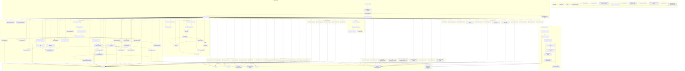

```mermaid
flowchart TD

    %% ====================================
    %% 1. USER ENTRY + AUTH FLOW
    %% ====================================
    subgraph FE[Frontend User Entry + Auth Flow]
        U0([User Opens App])
        U1[Angular Router]
        U2["/login"]
        U3[Authenticated in Firebase?]
        U4[Click Google Sign-In]
        U5[Firebase Auth Popup]
        U6[AuthService.ensureUserDocument in Firestore user collection]
        U7[wallet_address missing? needsGetStarted]
        U8["/get-started"]
        U9[Fill wallets + currency + notifications + mobile]
        U10[POST /users/from-firebase]
        U11[AuthService.saveGetStartedDetails to Firestore]
        U12[Redirect to /login]
        U13[Enter app dashboard / protocol / BNPL / market flows]

        U0 --> U1 --> U2 --> U3
        U3 -- No --> U4 --> U5 --> U6 --> U7
        U3 -- Yes --> U7
        U7 -- Yes --> U8 --> U9 --> U10 --> U11 --> U12 --> U13
        U7 -- No --> U13
    end

    %% ====================================
    %% 2. FASTAPI APP BOOT FLOW
    %% ====================================
    subgraph BOOT[FastAPI Startup Flow]
        A0[main.py create_app]
        A1[Load YAML config via core.config]
        A2[Build and include routers]
        A3[Include build_router]
        A4[Include build_risk_router]
        A5[Start LiquidationPoller on startup]

        A0 --> A1 --> A2
        A2 --> A3
        A2 --> A4
        A2 --> A5
    end

    %% ====================================
    %% 3. EXTERNAL / INFRA SYSTEMS
    %% ====================================
    subgraph EXT[External and Infra Systems]
        E1[(Firebase Firestore)]
        E2[(BSC RPC)]
        E3[(opBNB RPC)]
        E4[(Market API: CryptoCompare / CoinCap)]
        E5[(Currency API: Frankfurter / OpenER)]
        E6[(Razorpay API)]
        E7[(ML Artifacts: backend/ml/artifacts/*.joblib)]
        E8[(Contracts: LendingEngine / PriceConsumer / LiquidationArchive / DebtToken)]
    end

    %% ====================================
    %% 4. PROFILE + USER DATA APIs
    %% ====================================
    subgraph PROFILE[Profile and User Data APIs]
        P1[POST /users]
        P2[POST /users/from-firebase]
        P3[GET /users/user_id]
        P4[GET /users/user_id/wallets]
        P5[PUT /users/user_id]
        P6[GET /firebase/health]
    end

    A3 --> P1
    A3 --> P2
    A3 --> P3
    A3 --> P4
    A3 --> P5
    A3 --> P6

    P1 --> E1
    P2 --> E1
    P3 --> E1
    P4 --> E1
    P5 --> E1
    P6 --> E1

    %% ====================================
    %% 5. WALLET + WEB3 READ APIs
    %% ====================================
    subgraph WEB3[Wallet and Web3 Read APIs]
        W1[GET /wallet/validate]
        W2[GET /wallet/balance]
        W3[GET /get-data]
        W4[GET /web3/get-data]
        W5[GET /web3/health]
        W6[GET /web3/account/wallet]
        W7[GET /web3/tx-history/wallet]
    end

    A3 --> W1
    A3 --> W2
    A3 --> W3
    A3 --> W4
    A3 --> W5
    A3 --> W6
    A3 --> W7

    W2 --> E2
    W2 --> E3
    W3 --> E2
    W3 --> E3
    W4 --> E2
    W4 --> E3
    W5 --> E2
    W5 --> E3
    W6 --> E2
    W6 --> E3
    W7 --> E2
    W7 --> E3
    W6 --> E8
    W7 --> E8

    %% ====================================
    %% 6. MARKET + CURRENCY APIs
    %% ====================================
    subgraph UTIL[Market and Currency Utility APIs]
        M1[POST /market/chart]
        M2[GET /market/symbols]
        M3[GET /market/resolve]
        M4[GET /currency/convert]
        M5[GET /settings]
    end

    A3 --> M1
    A3 --> M2
    A3 --> M3
    A3 --> M4
    A3 --> M5

    M1 --> E4
    M2 --> E4
    M3 --> E4
    M4 --> E5

    %% ====================================
    %% 7. PROTOCOL LENDING FLOW
    %% ====================================
    subgraph PROTOCOL[Protocol Lending Simulation APIs]
        R1[POST /oracle/update-prices]
        R2[GET /oracle/prices]
        R3[POST /users/set-currency]
        R4[POST /collateral/deposit]
        R5[POST /borrow]
        R6[GET /account/wallet]
        R7[Repay or Liquidate?]
        R8[POST /repay]
        R9[POST /liquidate]
        R10[GET /archive/liquidations]
        R11[GET /stats]

        R1 --> R2
        R3 --> R4 --> R5 --> R6 --> R7
        R7 -- Repay --> R8 --> R6
        R7 -- Liquidate --> R9 --> R10 --> R11
    end

    A3 --> R1
    A3 --> R2
    A3 --> R3
    A3 --> R4
    A3 --> R5
    A3 --> R6
    A3 --> R8
    A3 --> R9
    A3 --> R10
    A3 --> R11

    %% ====================================
    %% 8. BNPL FLOW
    %% ====================================
    subgraph BNPL[BNPL End-to-End APIs]
        B0[GET /bnpl/features/status]
        B1[GET /bnpl/emi/plans]
        B1A[GET /bnpl/emi/plans/plan_id]
        B2[POST /bnpl/plans create loan + installments]
        B3[POST /bnpl/collateral/lock]
        B4[POST /bnpl/collateral/topup]
        B5[GET /bnpl/safety-meter/loan_id]
        B6[POST /bnpl/alerts/scan]
        B7[GET /bnpl/eligibility/user_id]
        B8[PATCH /bnpl/users/autopay]
        B9[POST /bnpl/users/autopay/mandate]
        B10[POST /bnpl/disputes/open]
        B11[POST /bnpl/disputes/resolve]
        B12[POST /bnpl/disputes/refund]
        B13[POST /bnpl/payments/late-fee/preview]
        B14[POST /bnpl/simulations/missed-payment]
        B15[POST /bnpl/recovery/partial]
        B16[POST /bnpl/merchant/settlements]
        B17[GET /bnpl/merchant/merchant_id/dashboard]
        B18[GET /bnpl/merchant/risk-view/loan_id]
        B19[POST /bnpl/risk/score/loan_id]
        B20[GET /bnpl/risk/recommend-deposit/loan_id]
        B21[POST /bnpl/risk/default-nudge]
        B22[GET /bnpl/explainability/loan_id]
        B23[GET /bnpl/proof/loan_id]
        B24[GET /bnpl/oracle/guard]
        B25[GET /bnpl/audit/events]
        B26[PATCH /bnpl/admin/pause]
        B27[GET /bnpl/payments/razorpay/status]
        B28[GET /bnpl/payments/razorpay/features]
    end

    A3 --> B0
    A3 --> B1
    A3 --> B1A
    A3 --> B2
    A3 --> B3
    A3 --> B4
    A3 --> B5
    A3 --> B6
    A3 --> B7
    A3 --> B8
    A3 --> B9
    A3 --> B10
    A3 --> B11
    A3 --> B12
    A3 --> B13
    A3 --> B14
    A3 --> B15
    A3 --> B16
    A3 --> B17
    A3 --> B18
    A3 --> B19
    A3 --> B20
    A3 --> B21
    A3 --> B22
    A3 --> B23
    A3 --> B24
    A3 --> B25
    A3 --> B26
    A3 --> B27
    A3 --> B28

    %% Main BNPL sequence
    B0 --> B1 --> B1A --> B2 --> B3 --> B5
    B5 --> B4 --> B5
    B5 --> B6
    B5 --> B7
    B2 --> B8 --> B9
    B2 --> B10 --> B11 --> B12
    B2 --> B13 --> B14 --> B15 --> B16 --> B17
    B2 --> B18
    B2 --> B19 --> B20 --> B22
    B2 --> B21 --> B22
    B2 --> B23
    B2 --> B24
    B2 --> B25
    B26 --> B2

    %% Persistence / integrations
    B2 --> E1
    B3 --> E1
    B4 --> E1
    B5 --> E1
    B6 --> E1
    B8 --> E1
    B10 --> E1
    B11 --> E1
    B15 --> E1
    B16 --> E1
    B17 --> E1
    B18 --> E1
    B19 --> E1
    B21 --> E1
    B23 --> E1
    B25 --> E1

    B9 --> E6
    B12 --> E6
    B16 --> E6

    %% ====================================
    %% 9. ML RUNTIME INFERENCE
    %% ====================================
    subgraph MLRT[ML Runtime Inference APIs]
        L1[GET /ml/health]
        L2[GET /ml/payload-specs]
        L3[POST /ml/payload-analyze]
        L4[POST /ml/payload-build-training-row]
        L5[POST /ml/score risk-tier]
        L6[POST /ml/predict-default]
        L7[POST /risk/recommend-deposit policy]
        L8[POST /ml/recommend-deposit model]
        L9[POST /ml/orchestrate]
        L10[POST /ml/emi/evaluate]
        L11[GET /ml/deposit-health]
        L12[GET /ml/default-health]
    end

    A3 --> L1
    A3 --> L2
    A3 --> L3
    A3 --> L4
    A3 --> L5
    A3 --> L6
    A3 --> L7
    A3 --> L8
    A3 --> L9
    A3 --> L10
    A3 --> L11
    A3 --> L12

    L5 --> E7
    L6 --> E7
    L8 --> E7
    L9 --> E7
    L10 --> E7

    %% ====================================
    %% 10. ML TRAINING + MANAGEMENT
    %% ====================================
    subgraph MLMGMT[ML Dataset, Training, Reload APIs and Scripts]
        T1[GET /ml/runtime/status]
        T2[GET /ml/training/specs]
        T3[POST /ml/training/generate-dataset]
        T4[POST /ml/training/train]
        T5[POST /ml/runtime/reload]
        T6[PATCH /ml/runtime/default-thresholds]
        T7[CLI backend/scripts/generate_*_data.py]
        T8[CLI backend/scripts/train_*_model.py]
        T9[Root pipeline ml/training/run_training.py]
    end

    A3 --> T1
    A3 --> T2
    A3 --> T3
    A3 --> T4
    A3 --> T5
    A3 --> T6

    T3 --> E7
    T4 --> E7
    T5 --> E7
    T7 --> E7
    T8 --> E7
    T9 --> E7

    %% ====================================
    %% 11. RISK V2 ROUTER
    %% ====================================
    subgraph RISKV2[Risk v2 API]
        RV1[POST /api/risk/predict]
        RV2[xgboost predictor available?]
        RV3[Use root ml/inference/predictor.py]
        RV4[Fallback heuristic]

        RV1 --> RV2
        RV2 -- Yes --> RV3
        RV2 -- No --> RV4
    end

    A4 --> RV1
    RV3 --> E7

    %% ====================================
    %% 12. BACKGROUND LIQUIDATION POLLER
    %% ====================================
    subgraph POLLER[Background Liquidation Poller]
        Q1[Startup hook triggered]
        Q2[liquidator.enabled and config valid?]
        Q3[Initialize Web3 client + contract handles]
        Q4[Loop every poll_interval_sec]
        Q5[Read borrower list from config]
        Q6[Read health factor from contract]
        Q7[Health factor below threshold?]
        Q8[Build + sign + send liquidation transaction]
        Q9[Log tx hash and continue loop]

        Q1 --> Q2
        Q2 -- Yes --> Q3 --> Q4 --> Q5 --> Q6 --> Q7
        Q7 -- Yes --> Q8 --> Q9 --> Q4
        Q7 -- No --> Q4
    end

    A5 --> Q1
    Q3 --> E2
    Q6 --> E8
    Q8 --> E8
```