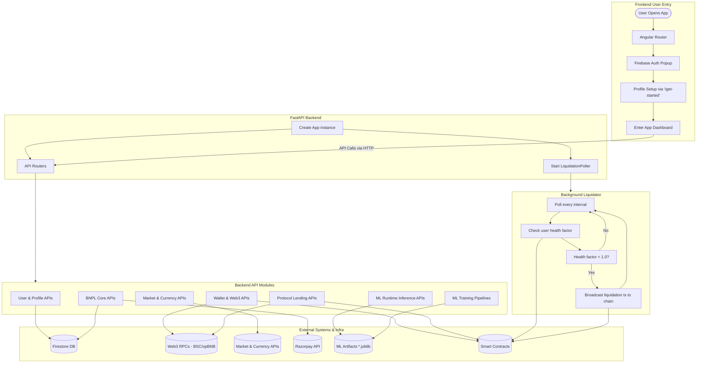

```mermaid
flowchart TD

    %% ====================================
    %% 1. USER ENTRY + AUTH FLOW
    %% ====================================
    subgraph FE[Frontend User Entry]
        U0([User Opens App])
        U1[Angular Router]
        U2[Firebase Auth Popup]
        U3[Profile Setup via '/get-started']
        U4[Enter App Dashboard]

        U0 --> U1 --> U2 --> U3 --> U4
    end

    %% ====================================
    %% 2. BACKEND APP BOOT FLOW
    %% ====================================
    subgraph BOOT[FastAPI Backend]
        A0[Create App instance]
        A1[API Routers]
        A2[Start LiquidationPoller]

        A0 --> A1
        A0 --> A2
    end

    %% ====================================
    %% 3. EXTERNAL / INFRA SYSTEMS
    %% ====================================
    subgraph EXT[External Systems & Infra]
        E1[(Firestore DB)]
        E2[(Web3 RPCs - BSC/opBNB)]
        E3[(Market & Currency APIs)]
        E4[(Razorpay API)]
        E5[(ML Artifacts *.joblib)]
        E6[(Smart Contracts)]
    end

    U4 -->|API Calls via HTTP| A1

    %% ====================================
    %% 4. SUMMARIZED BACKEND MODULES
    %% ====================================
    subgraph MODULES[Backend API Modules]
        M1[User & Profile APIs]
        M2[Wallet & Web3 APIs]
        M3[Market & Currency APIs]
        M4[Protocol Lending APIs]
        M5[BNPL Core APIs]
        M6[ML Runtime Inference APIs]
        M7[ML Training Pipelines]
    end

    A1 --> MODULES

    M1 --> E1
    M2 --> E2
    M2 --> E6
    M3 --> E3
    M4 --> E6
    M4 --> E2
    M5 --> E1
    M5 --> E4
    M6 --> E5
    M7 --> E5

    %% ====================================
    %% 5. BACKGROUND LIQUIDATION POLLER
    %% ====================================
    subgraph POLLER[Background Liquidator]
        Q1[Poll every interval]
        Q2[Check user health factor]
        Q3[Health factor < 1.0?]
        Q4[Broadcast liquidation tx to chain]

        Q1 --> Q2 --> Q3
        Q3 -- "Yes" --> Q4 --> Q1
        Q3 -- "No" --> Q1
    end

    A2 --> POLLER
    Q2 --> E6
    Q4 --> E6
```