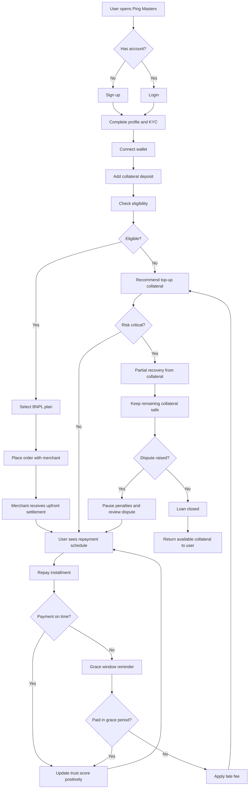

```mermaid
flowchart TD
    A["User opens Ping Masters"]
    B{"Has account?"}
    C["Sign up"]
    D["Login"]
    E["Complete profile and KYC"]
    F["Connect wallet"]
    G["Add collateral deposit"]
    H["Check eligibility"]
    I{"Eligible?"}
    J["Select BNPL plan"]
    K["Place order with merchant"]
    L["Merchant receives upfront settlement"]
    M["User sees repayment schedule"]
    N["Repay installment"]
    O{"Payment on time?"}
    P["Update trust score positively"]
    Q["Grace window reminder"]
    R{"Paid in grace period?"}
    S["Apply late fee"]
    T["Recommend top-up collateral"]
    U{"Risk critical?"}
    V["Partial recovery from collateral"]
    W["Keep remaining collateral safe"]
    X{"Dispute raised?"}
    Y["Pause penalties and review dispute"]
    Z["Loan closed"]
    AA["Return available collateral to user"]

    A --> B
    B -- "No" --> C
    B -- "Yes" --> D
    C --> E
    D --> E
    E --> F
    F --> G
    G --> H
    H --> I
    I -- "No" --> T
    I -- "Yes" --> J
    J --> K
    K --> L
    L --> M
    M --> N
    N --> O
    O -- "Yes" --> P
    P --> M
    O -- "No" --> Q
    Q --> R
    R -- "Yes" --> P
    R -- "No" --> S
    S --> T
    T --> U
    U -- "No" --> M
    U -- "Yes" --> V
    V --> W
    W --> X
    X -- "Yes" --> Y
    Y --> M
    X -- "No" --> Z
    Z --> AA
```